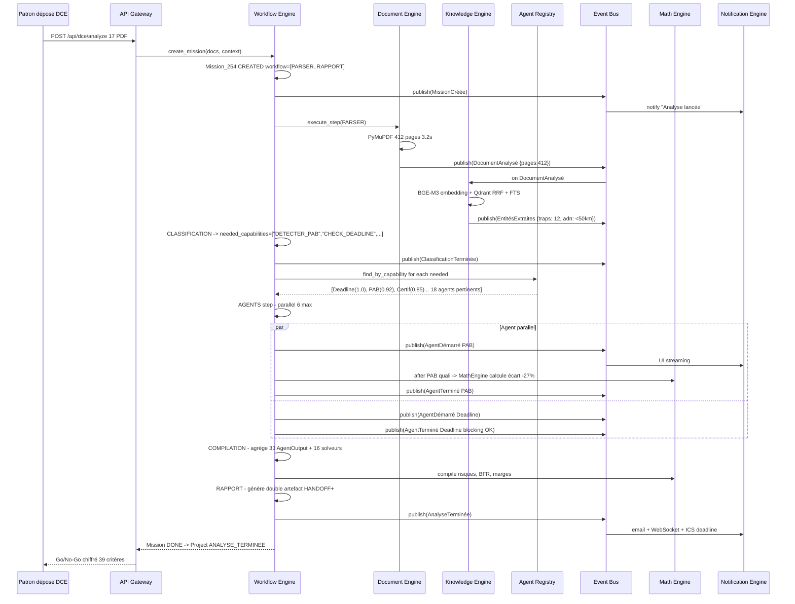
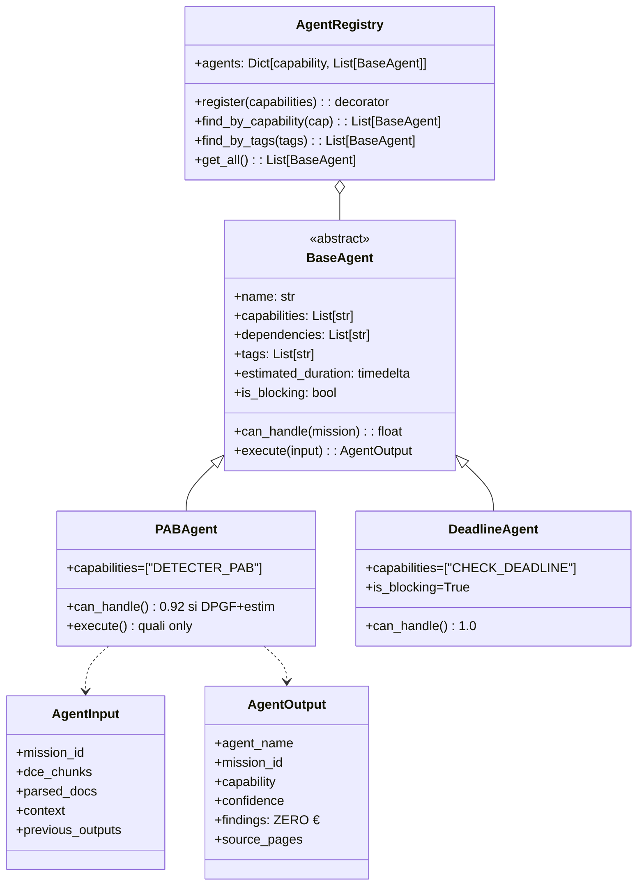
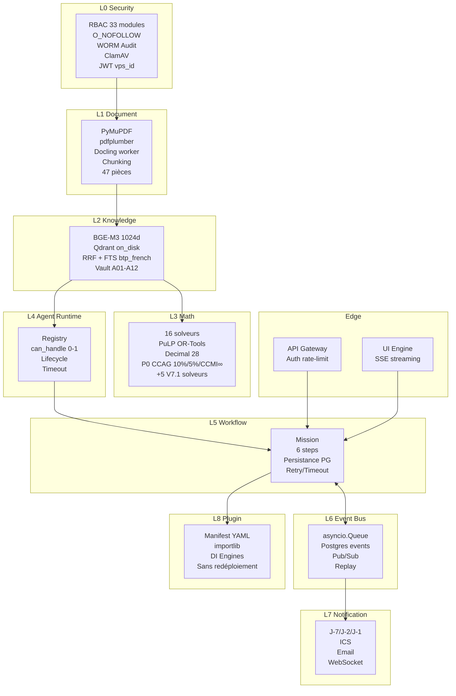
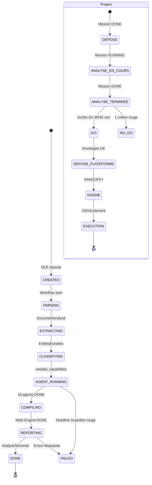

# SMART_AO - ARCHITECTURE V7 - ENGINE OS

> **Classification : CONFIDENTIEL - NIVEAU ARCHITECTE FONDATEUR V7**
> **Statut : Source Unique Architecture - SSoT Architecture entre RAPPORT et HANDBOOK**
> **Version : V7.1 Engine OS - 33 agents -> 100 agents scalables - 9 Moteurs + 2 Edge**
> **Dépend de : RAPPORT (1).md §7.1-7.33 (fonctionnel) | ENGINEERING-HANDBOOK V7.1 (technique pur)**
> **Référence par : PLAN_MAITRE_V7.1 §4-7 (ex-MES + PLAN_CODAGE fusionnés)**

---

## 0. Pourquoi V7 existe - Diagnostic V6

**V6 fonctionnellement juste mais architecturalement faux.**

V6 = 28 experts dans un open-space sans manager:
```python
# app/api/dce_analyze.py V6 - ANTI-PATTERN
if besoin_finance: lancer_finance_agent()
if besoin_certif: lancer_certif_agent()
if besoin_pab: lancer_pab_detector()
# ... x28 -> à 100 agents = 100 if, impossible à tester, paralléliser, étendre
```

**Conséquences:**
- Chaque nouvel agent oblige à modifier le cœur (OCP violé)
- Pas de traçabilité d'exécution (qui a tourné, combien de temps, quel output)
- Pas de parallélisation contrôlée, pas de retry/timeout par étape
- Impossible d'ajouter BIM/Assurance/Facturation sans toucher orchestrateur

**V7 = passage de Produit à OS.** Les 33 agents deviennent des Applications qui tournent sur un Kernel de 9 Engines + 2 Edge. Comme Word tourne sur Windows.

---

## 1. Les 9 Engines + 2 Edge - Kernel SMART AO V7.1

```
SMART_AO V7 OS/
├── L0: Security Engine    -> RBAC 33 modules, O_NOFOLLOW, FileLock, WORM, ClamAV, Argon2id, JWT vps_id
├── L1: Document Engine   -> Parser PyMuPDF/pdfplumber, Docling worker isolé, OCR, chunking, 47 pièces classif
├── L2: Knowledge Engine   -> RAG Hybrid BGE-M3 1024dim, Qdrant on_disk dense+sparse RRF, FTS btp_french, fallback + LOCAL LLM FALLBACK (Mistral 7B/Llama 3 8B via Ollama pour DCE Confidentiel Défense/Nucléaire)
├── L3: Math Engine       -> 16 solveurs ZERO LLM (ex-mathbox): PuLP, OR-Tools, Decimal 28 to_decimal(str)
├── L4: Agent Runtime     -> Registry, cycle de vie, supervision, can_handle scoring
├── L5: Workflow Engine   -> Mission, Steps, tour de contrôle, persistance Postgres, rejouabilité
├── L6: Event Bus         -> Pub/Sub intra-VPS asyncio + persistence, events standardisés
├── L7: Notification Engine -> Deadline J-7/J-2, ICS, emails, WebSocket UI
├── L9: Fleet Management Engine (V7.1 NEW) -> Pull-based updates, cosign verify, docker pull chiffré, heartbeat licensing
└── L8: Plugin Engine     -> Chargement agents externes BIM/Assurance sans redéploiement (importlib + manifest)
   Edge: API Gateway      -> Auth, rate-limit, routing -> délègue au Workflow Engine
   Edge: UI Engine        -> Rendering, streaming SSE/WebSocket depuis Workflow Engine
```

**Règles d'isolation:**
- Tous les Engines tournent dans le même VPS Single-Tenant (1 VPS = 1 client) - PAS de multi-tenant
- Event Bus = asyncio.Queue en mémoire + table `events` Postgres pour replay, PAS Kafka/Redis Streams lourd (contrainte 16Go RAM)
- Math Engine = ZERO import openai/anthropic/langchain (test bloquant `test_math_engine_no_llm_import`)
- Security Engine = SSoT RBAC, toute API passe par `require_admin + strip_provisions_euros_v71`

### Détail responsabilités

**Workflow Engine (Tour de contrôle)**
- Ne fait RIEN lui-même. Il orchestre.
- Gère `Mission` avec 6 étapes canoniques: `[PARSER, EXTRACTION, CLASSIFICATION, AGENTS, COMPILATION, RAPPORT]`
- Chaque étape: `status`, `started_at`, `ended_at`, `retry_count`, `timeout`, `output_ref`
- Persistance en Postgres `missions` + `mission_steps` pour rejouabilité et observabilité
- Publie events à chaque transition

**Agent Runtime (RH des agents)**
- `AgentRegistry`: `register()`, `find_by_capability()`, `find_by_tag()`, `get_all()`
- Cycle de vie: `DISCOVERED -> INSTALLED -> READY -> RUNNING -> DONE/FAILED`
- Supervision: timeout par agent via `estimated_duration`, kill + retry
- Scoring: `can_handle(mission) -> 0.0-1.0` pour pertinence

**Math Engine (Garage)**
- 16 solveurs V7.1 (11 V6 conservés + 5 nouveaux), déplacés de `app/mathbox/` -> `app/engines/math_engine/`
- Liste: `bt_projection`, `penalites_cumul P0 10%/5%/CCMI∞+1000€`, `rep_cost`, `site_coeff`, `incoherence_solver`, `capacite_financiere`, `risques_generator`, `mapa_generator`, `eplusc_calculator`, `pab_detector`, `materiaux_shield P0`
- Référentiels `data/referentiels/` inchangés, injectés via Knowledge Engine

**Knowledge Engine**
- `embedding_engine.py` + `vault_semantic_search.py` + `document_chunker.py` migrés de `app/services/`
- Collections Qdrant: `dce`, `vault`, `chantiers`, `traps` sans préfixe tenant (Single-Tenant pur)
- Fallback FTS Postgres `btp_french` custom si Qdrant down

**Document Engine**
- `document_parser.py` + `docling_worker.py` migrés
- Responsabilité: `DocumentAnalysé` event avec `{pages, duree_parse, chunks, type_marche}`

**Security Engine**
- `security.py` + `filesystem_mcp.py` (O_NOFOLLOW+fstat) + `audit WORM`
- RBAC 33 modules + HANDOFF double artefact + Vault J-30

**Notification Engine**
- Deadline Guardian J-7/J-2/J-1/H-4, Post-Gagné J-30/J-15/J-3, Certif J-90/J-60/J-30
- Transport: email + ICS + WebSocket

**Plugin Engine**
- Manifest YAML: `name, version, capabilities[], dependencies[], entrypoint`
- Chargement dynamique via `importlib.util.spec_from_file_location`
- Isolation: plugin ne peut importer que `BaseAgent` + Engines via DI, pas `app/core` direct

---

## 2. Contrat Unique BaseAgent - SSoT Agent

C'est la pierre angulaire V7. Tous les agents, du Deadline Guardian au Contentieux Generator, même structure.

```python
from abc import ABC, abstractmethod
from typing import List, Dict
from datetime import timedelta
from pydantic import BaseModel

class AgentInput(BaseModel):
    mission_id: str
    dce_chunks: List[Dict]  # from Knowledge Engine
    parsed_docs: Dict       # from Document Engine
    context: Dict           # Vault A01-A12, historique, etc.
    previous_outputs: Dict[str, "AgentOutput"] = {}  # outputs des agents dépendants

class AgentOutput(BaseModel):
    agent_name: str
    mission_id: str
    capability: str
    confidence: float  # 0.0-1.0
    status: str  # SUCCESS, PARTIAL, FAILED, SKIPPED
    findings: List[Dict]  # JSON quali ZERO € obligatoire
    # INTERDIT: tout champ € ici. Les € sont calculés par Math Engine ensuite
    warnings: List[str] = []
    execution_time_ms: int
    source_pages: List[int] = []  # traçabilité page source pour chaque finding

class BaseAgent(ABC):
    @property
    @abstractmethod
    def name(self) -> str: 
        """Ex: 'PAB Detector'"""

    @property
    @abstractmethod
    def capabilities(self) -> List[str]: 
        """Ex: ['DETECTER_PAB', 'CALCULER_ECART_MARCHE'] - SSoT capacités"""

    @property
    def dependencies(self) -> List[str]: 
        """Ex: ['PARSER', 'CHIFFRAGE'] - autres capabilities requises"""
        return []

    @property
    def tags(self) -> List[str]:
        """Ex: ['finance', 'risque', 'bloquant']"""
        return []

    @property
    def estimated_duration(self) -> timedelta:
        return timedelta(seconds=12)

    @property
    def is_blocking(self) -> bool:
        """Si True, échec = Mission FAILED (ex: Deadline Guardian)"""
        return False

    def can_handle(self, mission: "Mission") -> float:
        """
        Score pertinence 0.0-1.0
        0.0 = pas pertinent pour ce DCE
        1.0 = critique
        Ex: PAB a DPGF + estimation interne = 0.92
        Deadline Guardian a date_limite = 1.0 toujours
        """
        return 0.5

    @abstractmethod
    async def execute(self, input: AgentInput) -> AgentOutput:
        """
        ZERO € garanti par le type:
        - Ne retourne JAMAIS de montant €, marge, coeff
        - Retourne uniquement du quali + source_pages
        - Math Engine fera le chiffrage après
        """
        pass

    def score_capabilities(self, mission) -> float:
        # Helper scoring par défaut
        return 0.5
```

**Règles opposables:**
- Tout agent V7 hérite de `BaseAgent` dans `app/agents/`
- `AgentOutput.findings` = ZERO € regex check `test_agent_no_euro.py` conserve validité
- `estimated_duration` utilisé par Workflow Engine pour timeout + parallélisation
- `dependencies` = capabilities, pas noms de fichiers (découplage)

**Exemple migration PAB:**

```python
@registry.register(capabilities=["DETECTER_PAB", "CALCULER_ECART_MARCHE"])
class PABAgent(BaseAgent):
    name = "PAB Detector"
    capabilities = ["DETECTER_PAB", "CALCULER_ECART_MARCHE"]
    dependencies = ["PARSER", "CHIFFRAGE"]
    tags = ["finance", "risque", "admin_only"]
    estimated_duration = timedelta(seconds=8)
    is_blocking = False

    def can_handle(self, mission: Mission) -> float:
        has_dpgf = mission.has_document_type("DPGF")
        has_estimation = mission.context.get("estimation_interne") is not None
        if has_dpgf and has_estimation:
            return 0.92
        return 0.15

    async def execute(self, input: AgentInput) -> AgentOutput:
        # IA ZERO €: détecte écart, pas de calcul €
        ecart_quali = self.detect_ecart(input.dce_chunks)  # ex: "fortement inférieur"
        return AgentOutput(
            agent_name=self.name,
            mission_id=input.mission_id,
            capability="DETECTER_PAB",
            confidence=0.88,
            status="SUCCESS",
            findings=[{"type": "PAB_SUSPECT", "niveau": "ELEVE", "cause": "prix inférieur moyenne"}],
            source_pages=[12, 45]
        )
        # Le calcul € exact -27% sera fait par Math Engine pab_detector.py
```

---

## 3. Agent Registry + Découverte par Capabilités

L'orchestrateur ne connaît plus aucun agent. Il connaît des capabilités.

```python
# app/agents/registry.py
class AgentRegistry:
    _instance = None
    agents: Dict[str, BaseAgent] = {}

    def register(self, capabilities: List[str]):
        def decorator(cls):
            instance = cls()
            for cap in capabilities:
                self.agents.setdefault(cap, []).append(instance)
            return cls
        return decorator

    def find_by_capability(self, capability: str) -> List[BaseAgent]:
        return self.agents.get(capability, [])

    def find_by_tags(self, tags: List[str]) -> List[BaseAgent]:
        # intersection tags
        pass

    def get_all(self) -> List[BaseAgent]:
        return list(set([a for caps in self.agents.values() for a in caps]))

# Usage dans Workflow Engine
registry = AgentRegistry()
capables = registry.find_by_capability("DETECTER_RISQUE_FINANCIER")
# -> [PABAgent, FinanceAgent, MateriauxShieldAgent]
# L'orchestrateur ne connait pas leur code, juste leur contrat
```

**Découverte auto au boot:**
```python
# app/agents/__init__.py
import importlib, pkgutil
for _, modname, _ in pkgutil.iter_modules(["app/agents"]):
    if modname.startswith("agent_"):
        importlib.import_module(f"app.agents.{modname}")
# Chaque fichier a @registry.register au top-level
```

---

## 4. Mission + Workflow Engine - Tour de contrôle

```python
from enum import Enum
from datetime import datetime

class MissionStatus(str, Enum):
    CREATED = "CREATED"
    PARSING = "PARSING"
    EXTRACTING = "EXTRACTING"
    CLASSIFYING = "CLASSIFYING"
    AGENT_RUNNING = "AGENT_RUNNING"
    COMPILING = "COMPILING"
    REPORTING = "REPORTING"
    DONE = "DONE"
    FAILED = "FAILED"

class StepStatus(str, Enum):
    PENDING = "PENDING"
    RUNNING = "RUNNING"
    DONE = "DONE"
    FAILED = "FAILED"
    SKIPPED = "SKIPPED"

class MissionStep(BaseModel):
    name: str  # PARSER, EXTRACTION, CLASSIFICATION, AGENTS, COMPILATION, RAPPORT
    status: StepStatus = StepStatus.PENDING
    started_at: Optional[datetime] = None
    ended_at: Optional[datetime] = None
    retry_count: int = 0
    output_ref: Optional[str] = None
    error: Optional[str] = None

class Mission(BaseModel):
    id: str  # mission_254
    type: str = "ANALYSE_DCE"
    status: MissionStatus = MissionStatus.CREATED
    documents: List[str]  # 17 PDF IDs
    workflow: List[MissionStep]
    current_step_idx: int = 0
    context: Dict = {}  # Vault, SIRET, etc.
    priority: str = "NORMALE"  # BASSE, NORMALE, HAUTE, URGENTE
    created_by: str
    project_id: Optional[str] = None

class WorkflowEngine:
    def __init__(self, registry: AgentRegistry, event_bus: "EventBus"):
        self.registry = registry
        self.event_bus = event_bus

    async def create_mission(self, docs: List[str], context: Dict) -> Mission:
        mission = Mission(
            id=f"mission_{uuid4().hex[:6]}",
            documents=docs,
            workflow=[
                MissionStep(name="PARSER"),
                MissionStep(name="EXTRACTION"),
                MissionStep(name="CLASSIFICATION"),
                MissionStep(name="AGENTS"),
                MissionStep(name="COMPILATION"),
                MissionStep(name="RAPPORT"),
            ],
            context=context
        )
        await self.persist(mission)
        await self.event_bus.publish(Event(type="MissionCréée", mission_id=mission.id))
        return mission

    async def run(self, mission: Mission):
        for idx, step in enumerate(mission.workflow):
            mission.current_step_idx = idx
            try:
                await self.execute_step(mission, step)
            except Exception as e:
                if step.name in ["PARSER", "CLASSIFICATION"]:  # bloquants
                    mission.status = MissionStatus.FAILED
                    await self.event_bus.publish(Event(type="MissionÉchouée", mission_id=mission.id, payload={"error": str(e)}))
                    raise
                # non bloquant: log + continue

    async def execute_step(self, mission: Mission, step: MissionStep):
        step.status = StepStatus.RUNNING
        step.started_at = datetime.utcnow()
        if step.name == "PARSER":
            await self.run_parser(mission)
        elif step.name == "AGENTS":
            await self.run_agents_parallel(mission)
        # ... autres steps
        step.status = StepStatus.DONE
        step.ended_at = datetime.utcnow()
        await self.event_bus.publish(Event(type=f"{step.name}Terminé", mission_id=mission.id))

    async def run_agents_parallel(self, mission: Mission):
        # Classification a déjà taggé les capabilités nécessaires
        needed_caps = mission.context.get("needed_capabilities", [])  # ex: ["DETECTER_PAB", "CHECK_DEADLINE"]
        agents_to_run = []
        for cap in needed_caps:
            agents_to_run.extend(self.registry.find_by_capability(cap))
        # Déduplication + tri par can_handle score
        agents_to_run = sorted(set(agents_to_run), key=lambda a: a.can_handle(mission), reverse=True)
        # Filtrage pertinence <0.2 = skip
        agents_to_run = [a for a in agents_to_run if a.can_handle(mission) >= 0.2]
        # Exécution parallèle avec semaphore (max 6 parallèles pour 16Go RAM)
        semaphore = asyncio.Semaphore(6)
        results = await asyncio.gather(*[self.run_one_agent(mission, a, semaphore) for a in agents_to_run])
        mission.context["agent_outputs"] = results
```

**Lien avec ProjectStatus existant (15 statuts):**
- Mission.status != Project.status
- Project.status = état métier (DEPOSE, GAGNE, etc.) - Voir RAPPORT §Q
- Mission.status = état technique d'une analyse
- Mapping: quand Mission DONE + Go = Project passe à ANALYSE_TERMINEE, etc.

---

## 5. Event Bus - Découplage total

```python
class Event(BaseModel):
    type: str  # "DocumentAnalysé", "RisqueDétecté", "MissionCréée"
    mission_id: str
    payload: Dict = {}
    timestamp: datetime = Field(default_factory=datetime.utcnow)
    source: str  # nom de l'engine/agent émetteur

class EventBus:
    def __init__(self):
        self.subscribers: Dict[str, List[Callable]] = {}
        self.queue = asyncio.Queue()
        self.persistent_table = "events"  # Postgres
        self.dead_letter_queue = "events_dlq"  # V7.1 NEW - Dead Letter Queue
    
    async def publish(self, event: Event):
        # 1. Persister en Postgres pour replay
        await self.persist(event)
        # 2. Mettre en queue mémoire
        await self.queue.put(event)
        # 3. Notifier subscribers directs (sync rapide)
        for handler in self.subscribers.get(event.type, []):
            asyncio.create_task(handler(event))

    # V7.1 NEW - Cron reconciliation
    async def reconcile_stuck_events(self):
        """Cron toutes les heures: scanner events RUNNING > timeout -> FORCED FAILED"""
        stuck = await self.fetch_events(status="RUNNING", older_than=timeout)
        for event in stuck:
            await self.move_to_dlq(event)
            await self.publish(Event(type="EventReconcilié", mission_id=event.mission_id))

    def subscribe(self, event_type: str):
        def decorator(func_or_cls):
            self.subscribers.setdefault(event_type, []).append(func_or_cls)
            return func_or_cls
        return decorator

    async def replay(self, mission_id: str) -> List[Event]:
        # Pour debug/rejouabilité
        return await self.fetch_events(mission_id)

event_bus = EventBus()

# Usage
@event_bus.subscribe("DocumentAnalysé")
class PABAgent(BaseAgent):
    ...

# Parser ne connait personne
await event_bus.publish(Event(
    type="DocumentAnalysé",
    mission_id="254",
    payload={"pages": 412, "duree_parse": "3.2s", "chunks": 1240},
    source="DocumentEngine"
))
```

**Events standardisés V7 (SSoT):**

| Event | Émetteur | Écouteurs | Payload |
|-------|----------|-----------|---------|
| MissionCréée | WorkflowEngine | Notification, Audit | mission_id, docs |
| DocumentAnalysé | DocumentEngine | Tous agents 7.1-7.33 | pages, chunks, type_marche |
| EntitésExtraites | KnowledgeEngine | Agents | adn_local, vault_match, traps |
| ClassificationTerminée | WorkflowEngine | WorkflowEngine | needed_capabilities[] |
| AgentDémarré | AgentRuntime | Notification, UI | agent_name, mission_id |
| AgentTerminé | AgentRuntime | WorkflowEngine, Compilation | agent_name, output_ref |
| RisqueDétecté | Agent | Compilation, UI | niveau, module, page |
| AnalyseTerminée | WorkflowEngine | Notification | mission_id, duree_totale |
| MissionÉchouée | WorkflowEngine | Notification, UI | error, step |

---

## 6. Les 5 Schémas Critiques

### Schéma 1: Flux Mission #254 bout en bout



### Schéma 2: Contrat BaseAgent + Registry



### Schéma 3: Event Bus + Dépendances

```mermaid
graph TD
    DE[Document Engine] -->|publie| E1[Event: DocumentAnalysé]
    KE[Knowledge Engine] -->|publie| E2[EntitésExtraites]
    WE[Workflow Engine] -->|publie| E3[ClassificationTerminée]
    WE -->|publie| E4[MissionCréée]
    
    E1 --> PAB[PAB Detector]
    E1 --> CERT[Certif Live Checker]
    E1 --> RSE[RSE Booster]
    E1 --> ALLOT[Alloti Guardian]
    E1 --> ENV[Enveloppe Separator]
    
    E2 --> FIN[Finance Agents]
    E2 --> TRAP[Trap Detector]
    
    E3 --> WE
    
    PAB -->|publie| E5[AgentTerminé]
    CERT -->|publie| E5
    E5 --> COMP[Compilation Engine]
    COMP --> MATH[Math Engine 16 solveurs]
    MATH -->|publie| E6[AnalyseTerminée]
    E6 --> NOTIF[Notification Engine]
    E6 --> UI[UI Engine WebSocket]

    style DE fill:#1a1a1a,stroke:#555
    style E1 fill:#2a2a00,stroke:#aa0
    style PAB fill:#0a2a0a,stroke:#0a0
```



### Schéma 4: Les 9 Engines + 2 Edge et leurs responsabilités (Layers 0-9)



### Schéma 5: Diagramme d'états Projet vs Mission



---

## 7. ADR V7 - 18 nouveaux (041-058)

**ADR-041 Workflow Engine**: Tour de contrôle, Missions 6 étapes, persistance PG, rejouabilité
**ADR-042 Agent Registry**: Découverte par capabilités, pas par fichier, scoring can_handle
**ADR-043 Event Bus**: Pub/Sub intra-VPS, asyncio + PG events, pas Kafka (16Go contrainte)
**ADR-044 BaseAgent**: Contrat uniforme 4 props + 2 méthodes, ZERO € garanti par type
**ADR-045 Math Engine**: Extraction mathbox -> engines/math_engine, ZERO LLM, Decimal 28
**ADR-046 Knowledge Engine**: RAG hybrid BGE-M3 Qdrant on_disk RRF + FTS btp_french
**ADR-047 Document Engine**: Parser PyMuPDF + Docling worker isolé, event DocumentAnalysé
**ADR-048 Security Engine**: RBAC 28 modules, O_NOFOLLOW+fstat, WORM, FileLock, ClamAV
**ADR-049 Notification Engine**: J-7/J-2/H-4 Deadline, J-30/J-15/J-3 Post-Gagné, ICS, WebSocket
**ADR-050 Plugin Engine**: Manifest YAML, importlib, DI, sans redéploiement
**ADR-051 API Gateway**: Endpoints délèguent au Workflow Engine, plus d'appel direct agents
**ADR-052 UI Engine**: Streaming SSE/WebSocket depuis Workflow Engine, plus de polling. **Intégration V3.2** : Wrapper Tauri v2 (Application Desktop Native) + Fallback Nginx pour accès VPS distant.
**ADR-053 Mission vs Project**: Mission = technique éphémère, Project = métier 15 statuts, mapping explicite
**ADR-054 Parallélisation**: Semaphore 6 max pour 16Go, tri par can_handle score, timeout per agent
**ADR-055 Compatibilité V6**: Build 0-2 inchangés, Builds 3-8 re-spécifiés, pas de big bang, feature flag
**ADR-056 Observabilité**: Chaque step tracé, event persistant, replay mission_id, Prometheus metrics
**ADR-057 P0 Préservation**: CCAG 10%/5%/CCMI∞+1000€ + avance 2024 + PAB + Matériaux conservés dans Math Engine
**ADR-058 Testabilité**: Registry mockable, EventBus in-memory pour tests, agents unit testables sans Workflow

**ADR-059 Fleet Management Engine (V7.1)**
Decision: Pull-based update sécurisé. VPS client interroge serveur central licences/updates via cosign verify + docker pull chiffré. Support n'accède jamais aux données.
Implementation: app/engines/fleet_engine/ updater.py, license_checker.py, cosign_verifier.py
Justification: 50 clients = 50 VPS. Sans Fleet Engine, mise à jour = enfer. Pull-based = sécurisé + scalable.
**Intégration V3.2** : Watermarking dynamique des exports PDF/Word (LicenseChecker applique "DEMO - NON VALABLE POUR DEPOT" si licence != Pro/Perpetuelle).

**ADR-060 Local LLM Fallback (V7.1)**
Decision: DCE marqués "Confidentiel Défense/Nucléaire" basculent sur modèle local quantizé (Mistral 7B/Llama 3 8B via Ollama/llama.cpp). Garage Math ZERO LLM reste inchangé.
Implementation: app/engines/knowledge_engine/local_llm.py, detect_confidentialite()
Justification: Ministère Armées, CEA, Seveso interdisent tout transfert API externe, même EU. On-Premise strict.

**ADR-061 Dead Letter Queue EventBus (V7.1)**
Decision: Cron reconciliation toutes les heures. Events RUNNING > timeout -> DLQ -> MissionEchouée -> replay possible.
Implementation: app/engines/event_bus/dlq.py, cron_reconciliation.py
Justification: 16Go RAM. Si WorkflowEngine plante sur DCE 800 pages, queue mémoire peut se remplir. DLQ + reconciliation = résilience.

**ADR-062 Pénurie & Pénibilité RH (V7.1)**
Decision: Nouveau module 7.29. Détection contraintes pénibilité + croisement Vault A04 RH + calcul surcoût intérim.
Implementation: agent_penibilite_rh.py + penibilite_solver.py
Justification: Pénurie main-d'œuvre = tueur de marge n°1 BTP 2026.

**ADR-063 Vigilance URSSAF & ZAN & Formules & Sourcing API (V7.1)**
Decision: 4 nouveaux modules 7.30-7.33. Blocage pénal URSSAF, coût ZAN/Trackterres, vérification algébrique formules, dépôt API natif.
Implementation: agent_vigilance_urssaf.py, agent_zan_trackterres.py, agent_formule_revision.py, agent_sourcing_api.py
Justification: Couverture complète chaîne: veille -> dépôt -> exécution -> contentieux -> conformité sociale/environnementale.

Voir ENGINEERING-HANDBOOK V7 § ADR pour détails techniques opposables.

---

## 8. Plan Migration détaillé sans Big Bang

### Phase 1 - Contrat + Registry (2 semaines) - ZERO BREAKING

1. Créer `app/agents/base_agent.py` + `app/agents/registry.py` (nouveaux fichiers)
2. Migrer 3 pilotes: Deadline, PAB, Certif vers BaseAgent
3. Garder ancien `dce_analyze.py` avec if/else pour 25 autres + wrapper Registry pour 3 nouveaux
4. Tests: `test_registry_discovery.py`, `test_base_agent_contract.py`
5. Gate: Registry trouve 3 agents par capabilité, flow V7.1 vert 39/46

### Phase 2 - Mission + Event Bus (3 semaines)

1. Créer `app/engines/workflow_engine/` (Mission, WorkflowEngine) + `app/engines/event_bus/`
2. Remplacer `dce_analyze.py` par WorkflowEngine avec 6 steps
3. Parser publie `DocumentAnalysé`, 33 agents s'abonnent progressivement (feature flag)
4. Tests: `test_workflow_engine.py`, `test_event_bus.py`, `test_mission_replay.py`
5. Gate: Mission #254 bout en bout avec 3 agents pilotes, replay OK

### Phase 3 - 8 Engines (4 semaines)

1. Déplacer:
   - `app/mathbox/` -> `app/engines/math_engine/`
   - `app/services/embedding_engine.py`, `app/rag/` -> `app/engines/knowledge_engine/`
   - `app/services/document_parser.py`, `docling_worker.py` -> `app/engines/document_engine/`
   - `app/core/security.py` RBAC -> `app/engines/security_engine/` (garder wrapper dans core)
   - `app/services/*guardian*` 33 agents -> `app/agents/agent_*.py`
2. Créer `notification_engine`, `ui_engine`, `api_gateway`, `plugin_engine` (nouveaux)
3. Adapter MCP pour publier sur EventBus
4. Tests: tous les 50+ tests V6 + 8 nouveaux engines

### Phase 4 - Intégration finale (1 semaine)

1. Migrer 25 agents restants vers BaseAgent
2. Supprimer ancien `if/else` orchestrateur
3. Test E2E 3 DCE réels 412 pages, 47 pièces
4. Go/No-Go 39/46 verts
5. Update docs finaux

**Calendrier total 10 semaines, équipe 2 devs. Accélération possible si 3 devs -> 7 semaines.**

---

## 9. Compatibilité et SSoT

- **SSoT Fonctionnel**: RAPPORT (1).md §7.1-7.33 reste SSoT modules. ARCHITECTURE_V7_ENGINE.md ne redéfinit pas le fonctionnel, uniquement l'architecture
- **SSoT Technique**: ENGINEERING-HANDBOOK V7 = C4 + ADR 001-058 + contrats API
- **SSoT Build**: PLAN_MAITRE_V7.1 (ex-MES + PLAN_CODAGE fusionnés) = ordre builds 0-9 + 9.5
- **SSoT Arborescence**: Arborescence V7 = nouvelle structure engines/

**Aucune suppression V6**: Tout V6 conservé, enrichi, déplacé. Pas de réécriture fonctionnelle.

---

## 10. Checklist Go/No-Go V7.1 additionnelle

Ajout à 39/46 existants:

- [ ] `test_workflow_engine.py` vert - Mission créée, 6 steps, persistance PG
- [ ] `test_event_bus.py` vert - publish/subscribe + replay + persistance
- [ ] `test_registry_discovery.py` vert - find_by_capability retourne bons agents
- [ ] `test_base_agent_contract.py` vert - 33 agents héritent BaseAgent, ZERO €
- [ ] `test_math_engine_no_llm_import` vert après déplacement
- [ ] `test_mission_e2e_3_agents` vert - 3 pilotes bout en bout
- [ ] `test_plugin_engine_load.py` vert - chargement BIMAgent sans redéploiement

Total futur: 24+7=31 single, 31+7=38 fleet (proposition V7)

---

## 9. INTÉGRATION V3.2 → V7.1 : ARCHITECTURE DU "PONT TAURI"

> **Source unique intégration :** Rapport d'audit "V3.2 to V7.1" Passe 1/2 et Passe 2/2
> **Objectif :** Greffer le Kernel V7.1 sous le capot Tauri sans casser les 239 tests de la V3.2 et le build Desktop.

### 9.1 Philosophie du Pont Tauri

**Tauri devient le Client Edge Natif** qui consomme l'`API Gateway` et l'`UI Engine` du VPS Single-Tenant (ADR-001).

- **Conservation :** Le shell Tauri (React/TS/Tailwind/Zustand) est entièrement préservé
- **Transformation :** Son moteur de communication change radicalement
- **Avantage :** On conserve l'UX Anti-ERP de V3.2 tout en bénéficiant de la puissance du Kernel V7.1

### 9.2 Protocole de Communication Tauri ↔ UI Engine

Le shell Tauri V3.2 conserve son WebView mais se branche sur le WebSocket V7.1 :

```typescript
// desktop/src/bridge.ts
const ws = new WebSocket(`ws://${vps}/ws/mission/${missionId}`);
ws.onmessage = (e) => store.dispatch(eventFromV7(JSON.parse(e.data)));
```

**Flux :**
1. Tauri upload DCE (Step 2) → publie `DocumentAnalysé` sur EventBus
2. Les 33 agents s'abonnent et tournent en parallèle (semaphore max 6 pour 16Go RAM)
3. L'`UI Engine` pousse les événements (`AgentDémarré`, `RisqueDétecté`, `MathEngineDone`) en temps réel sur le Wizard
4. Le salarié voit la progression des 33 boucliers en streaming

**Avantage :** Plus de polling REST, communication temps réel avec WebSocket.

### 9.3 Mode Panique → Mission URGENTE Fast-Track

Le Mode Panique V3.2 (Ctrl+Shift+M, déclencheur automatique si deadline < 48h) devient une **Mission à priorité URGENTE** dans V7.1 :

```python
# app/engines/workflow_engine/mission.py
class MissionPriority(str, Enum):
    BASSE = "BASSE"
    NORMALE = "NORMALE"
    HAUTE = "HAUTE"
    URGENTE = "URGENTE"  # MODE PANIQUE - V3.2 intégré

# app/engines/workflow_engine/workflow.py
FAST_TRACK_CAPS = {
    "CHECK_DEADLINE", "GENERER_DC4", "SEPARER_ENVELOPPE",
    "DETECTER_PAB", "GENERER_MEMOIRE_TEMPLATE", "GENERER_DPGF_TEMPLATE",
}

async def run(self, mission: Mission) -> Mission:
    if mission.priority == MissionPriority.URGENTE:
        mission.context["fast_track"] = True
        mission.context["needed_capabilities"] = sorted(FAST_TRACK_CAPS)
        # bypass des agents longs (Mémoire Booster, RSE)
```

**Comportement :** Le Workflow Engine bypass les agents longs et déclenche uniquement les agents de survie pour sortir le ZIP minimum vital en **3 minutes**.

**Capacités fast-track (minimum vital) :**
- CHECK_DEADLINE
- GENERER_DC4
- SEPARER_ENVELOPPE
- DETECTER_PAB
- GENERER_MEMOIRE_TEMPLATE
- GENERER_DPGF_TEMPLATE

### 9.4 Routeur LLM V3.2 → V7.1

Le choix du LLM de V3.2 est préservé et enrichi dans un routeur unique :

```python
# app/engines/knowledge_engine/llm_router.py
class LLMRouter:
    def __init__(self, provider: str = "mistral", confidentiel: bool = False):
        if confidentiel:                      # DCE Confidentiel Défense/Nucléaire
            self.client = OllamaClient("mistral:7b")     # local, zéro sortie de données
        elif provider == "mistral":
            self.client = MistralEUClient()              # défaut souverain EU
        elif provider in ("openai", "deepseek", "kimi"): # opt-in explicite + disclaimer RGPD
            self.client = OpenAICompatible(provider)
```

**Règles :**
- **Défaut :** Mistral EU (souverain)
- **Confidentiel :** Ollama Mistral 7B local (zéro sortie de données)
- **Opt-in :** OpenAI/DeepSeek/Kimi avec disclaimer RGPD explicite
- **Doctrine :** Le LLM ne calcule JAMAIS les euros (Garage Math uniquement)

### 9.5 Gestion du Mode Déconnecté (Fleet Engine)

Si le VPS est inaccessible, Tauri bascule sur le **Local LLM Fallback** :

- **Extraction qualitative de base :** Ollama Mistral 7B local pour l'extraction
- **Blocage calculs financiers :** Garage Math exige le serveur → pas de calcul sans VPS
- **Sécurité :** Pas de fuite de données, tout reste local

### 9.6 Migration pgvector → Qdrant (Script One-Shot)

```python
# scripts/migrate_pgvector_qdrant.py
# Lire les embeddings pgvector de la v3.2, upsert dans Qdrant avec payload complet
for row in pg.execute("SELECT doc_id, chunk, embedding, meta FROM embeddings"):
    qdrant.upsert(collection="dce", points=[Point(id=row.doc_id,
        vector=row.embedding, payload=row.meta)])
```

**Exigence :** Migration 100% des chunks sans perte de données.

### 9.7 CLI Unifié `smartao` (Héritage V3.2)

```bash
# scripts/smartao
smartao          # backend + fenêtre desktop Tauri
smartao --dev    # rebuild Tauri à chaud
smartao --web    # backend seul (fallback web)
smartao --stop   # arrêt stack
```

**Fonctionnement :**
- `smartao` : Lance backend FastAPI + fenêtre desktop Tauri native
- `smartao --dev` : Mode développement avec rebuild Tauri à chaud
- `smartao --web` : Backend seul, accès via navigateur (fallback)
- `smartao --stop` : Arrêt complet de la stack Docker

### 9.8 Nouveau ADR pour l'Intégration V3.2 → V7.1

**ADR-064 Routeur LLM Souverain**
- **Decision :** Routeur LLM unique avec défaut Mistral EU, local Ollama pour Confidentiel, opt-in explicite pour hors-UE
- **Implementation :** `app/engines/knowledge_engine/llm_router.py`
- **Justification :** Respect souveraineté + flexibilité client

**ADR-065 Pont Tauri-UI Engine WebSocket**
- **Decision :** Tauri consomme UI Engine via WebSocket `/ws/mission/{id}` au lieu de polling REST
- **Implementation :** `desktop/src/bridge.ts` + `app/engines/ui_engine/websocket_manager.py`
- **Justification :** Temps réel, pas de charge serveur inutile

**ADR-066 Mode Panique = Mission URGENTE**
- **Decision :** Mode Panique V3.2 → Mission `priority=URGENTE` avec FAST_TRACK_CAPS
- **Implementation :** `workflow_engine/mission.py` + `workflow.py`
- **Justification :** Intégration propre dans l'architecture OS

**ADR-067 Migration pgvector→Qdrant One-Shot**
- **Decision :** Script de migration unique, exécutable une fois
- **Implementation :** `scripts/migrate_pgvector_qdrant.py`
- **Justification :** Migration sans downtime, 100% des données préservées

**ADR-068 CLI Unifiée `smartao`**
- **Decision :** CLI unique pour backend + Tauri + web + stop
- **Implementation :** `scripts/smartao`
- **Justification :** Simplicité d'utilisation, cohérence V3.2

### 9.9 Résumé de l'Intégration

**Ce qui est sauvé de V3.2 :**
- ✅ Shell Tauri (Application Desktop native)
- ✅ Mode Panique (transformé en Mission URGENTE)
- ✅ Onboarding 5 étapes
- ✅ CLI `smartao`
- ✅ Philosophie Anti-ERP

**Ce qui est abandonné de V3.2 :**
- ❌ Chat Orchestrateur (doctrine V7.1 : pas de chatbot)
- ❌ pgvector (remplacé par Qdrant)
- ❌ Architecture monolithe synchrone (remplacée par OS asynchrone)

**Ce qui est migre de V3.2 :**
- 🔄 Données embeddings (pgvector → Qdrant)
- 🔄 Stack technique (Redis/MinIO/Compose conservés)
- 🔄 Tests (239 tests V3.2 à conserver)

**Verdict architectural :** La V3.2 était une excellente base UX sur une mauvaise base technique. La V7.1 est l'inverse. L'intégration crée le meilleur des deux mondes : **l'UX agréable de V3.2 + le cerveau souverain de V7.1**. Tous les actifs V3.2 sont soit sauvés, soit migrés, soit abandonnés pour de bonnes raisons (technique ou doctrine).

---

**Fin ARCHITECTURE_V7_ENGINE.md - Document fondateur V7 OS - 8 Engines - BaseAgent - Registry - Mission - EventBus - 5 schémas Mermaid + Intégration V3.2 → V7.1**
